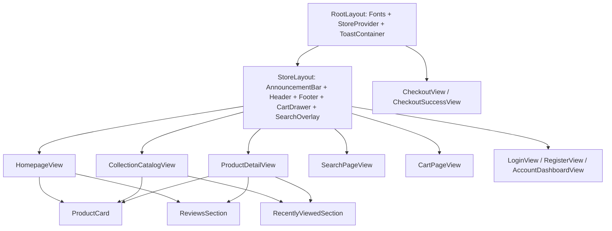

# Component Hierarchy

```mermaid
graph TD
  RootLayout[RootLayout: Fonts + StoreProvider + ToastContainer] --> StoreLayout[StoreLayout: AnnouncementBar + Header + Footer + CartDrawer + SearchOverlay]
  RootLayout --> CheckoutRoutes[CheckoutView / CheckoutSuccessView]
  StoreLayout --> HomepageView
  StoreLayout --> CollectionCatalogView
  StoreLayout --> ProductDetailView
  StoreLayout --> SearchPageView
  StoreLayout --> CartPageView
  StoreLayout --> AccountViews[LoginView / RegisterView / AccountDashboardView]
  HomepageView --> ProductCard
  HomepageView --> ReviewsSection
  CollectionCatalogView --> ProductCard
  CollectionCatalogView --> RecentlyViewedSection
  ProductDetailView --> ProductCard
  ProductDetailView --> RecentlyViewedSection
  ProductDetailView --> ReviewsSection
```
