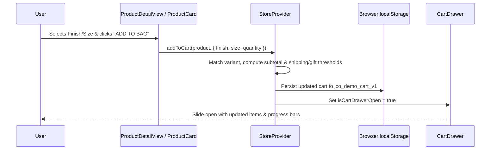

# Data Flow

```mermaid
sequenceDiagram
  participant User
  participant Component as ProductDetailView / ProductCard
  participant Store as StoreProvider
  participant Storage as Browser localStorage
  participant Drawer as CartDrawer

  User->>Component: Selects Finish/Size & clicks "ADD TO BAG"
  Component->>Store: addToCart(product, { finish, size, quantity })
  Store->>Store: Match variant, compute subtotal & shipping/gift thresholds
  Store->>Storage: Persist updated cart to jco_demo_cart_v1
  Store->>Drawer: Set isCartDrawerOpen = true
  Drawer-->>User: Slide open with updated items & progress bars
```
